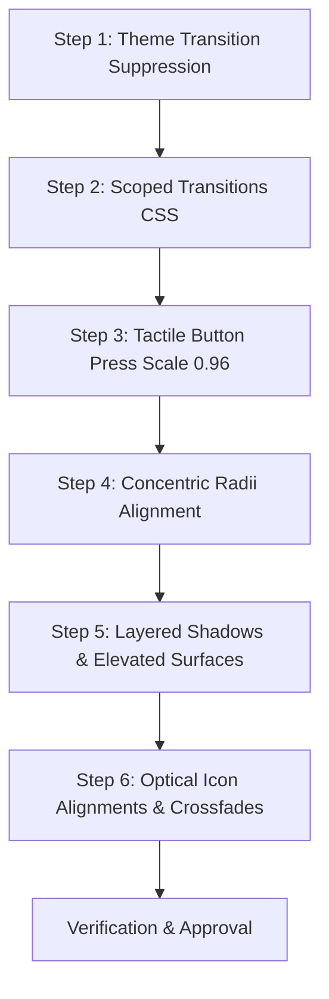

# UI Polish Remediation Plan (`better-ui`)

This document outlines the exact fixes, code recipes, and implementation strategy required to address all UI polish, motion, surface, and interaction issues identified in the `better-ui` audit of the application.

---

## Table of Contents
1. [Summary of Required Fixes](#summary-of-required-fixes)
2. [Fix 1: Suppress Transitions on Theme Switch (High Priority)](#fix-1-suppress-transitions-on-theme-switch-high-priority)
3. [Fix 2: Replace `transition-all` with Explicit Properties (Medium Priority)](#fix-2-replace-transition-all-with-explicit-properties-medium-priority)
4. [Fix 3: Standardize Button Press Feedback (`active:scale-[0.96]`) (Medium Priority)](#fix-3-standardize-button-press-feedback-activescale-096-medium-priority)
5. [Fix 4: Align Concentric Border Radii (Medium Priority)](#fix-4-align-concentric-border-radii-medium-priority)
6. [Fix 5: Layered Depth Shadows for Elevated Surfaces (Medium Priority)](#fix-5-layered-depth-shadows-for-elevated-surfaces-medium-priority)
7. [Fix 6: Fluid Icon State Crossfades & Optical Alignment (Low Priority)](#fix-6-fluid-icon-state-crossfades--optical-alignment-low-priority)
8. [Step-by-Step Implementation Roadmap](#step-by-step-implementation-roadmap)

---

## Summary of Required Fixes

| Priority | Area | Core Issue | Prescribed Fix |
| :--- | :--- | :--- | :--- |
| **P0 (HIGH)** | Theme Switching | Toggling light/dark mode causes global transition smearing. | Inject instant transition suppression override with reflow flush. |
| **P1 (MED)** | Transitions | Broad `transition-all` forces geometry & layout recalculations. | Scope transitions to `transition-colors`, `transition-transform`, or specific properties. |
| **P2 (MED)** | Button Feedback | Mixed `scale-95`, `scale-[0.98]`, or missing press feedback. | Standardize to `active:scale-[0.96] transition-transform duration-150 ease-out`. |
| **P3 (MED)** | Surface Radii | Nested elements share inconsistent corner radii ($r_o \neq r_i + p$). | Recalculate nested radii using concentric formula: $r_{\text{outer}} = r_{\text{inner}} + \text{padding}$. |
| **P4 (MED)** | Elevation & Depth | Heavy solid borders used for elevation instead of adaptive shadows. | Introduce layered `--shadow-border` tokens for cards and flyouts. |
| **P5 (LOW)** | Icons & Alignment | Rigid icon swaps and symmetrical padding on icon buttons. | Implement spring blur/scale crossfades and -2px icon-side optical padding. |

---

## Fix 1: Suppress Transitions on Theme Switch (High Priority)

### Problem
In `src/App.tsx`, theme toggling modifies the root `.dark` class directly. When theme changes, all elements with transitions on `background-color`, `border-color`, `color`, and `box-shadow` animate simultaneously over 200–300ms, resulting in a dirty, smeared transition.

### Solution
Inject a temporary style tag that forces `transition: none !important`, flush the DOM layout reflow via `document.body.offsetHeight`, toggle the `.dark` class, and remove the style tag on the subsequent animation frame.

### Code Implementation

#### File: `src/utils/themeTransitions.ts` (New Helper)
```typescript
/**
 * Safely switches theme without triggering transition smears across the DOM.
 */
export function setDarkModeWithoutTransitions(isDark: boolean): void {
  const style = document.createElement('style');
  style.appendChild(
    document.createTextNode('*, *::before, *::after { transition: none !important; }')
  );
  document.head.appendChild(style);

  if (isDark) {
    document.documentElement.classList.add('dark');
  } else {
    document.documentElement.classList.remove('dark');
  }

  // Force synchronous layout reflow so new theme styles commit immediately
  const _reflow = document.body.offsetHeight;

  // Restore transitions on the next frame after paint
  requestAnimationFrame(() => {
    requestAnimationFrame(() => {
      style.remove();
    });
  });
}
```

#### Update in `src/App.tsx`:
```diff
+ import { setDarkModeWithoutTransitions } from './utils/themeTransitions';

  useEffect(() => {
-   if (isDarkMode) {
-     document.documentElement.classList.add('dark');
-   } else {
-     document.documentElement.classList.remove('dark');
-   }
+   setDarkModeWithoutTransitions(isDarkMode);
    localStorage.setItem('stratum_darkMode', JSON.stringify(isDarkMode));
  }, [isDarkMode]);
```

---

## Fix 2: Replace `transition-all` with Explicit Properties (Medium Priority)

### Problem
`transition-all` forces the browser to watch and interpolate every animatable CSS property during state changes. This causes layout recalculation and frame stutter.

### Solution
Replace generic `transition-all` with targeted Tailwind transition utilities:
- For background, text, and border changes: `transition-colors duration-150 ease-out`
- For scale/translation: `transition-transform duration-150 ease-out`
- For cards with elevation: `transition-[box-shadow,border-color,transform] duration-200 ease-out`

### Code Examples

#### 1. In `src/index.css` (Sidebar Module Buttons):
```diff
  .sidebar-module-btn {
-   transition: all 0.2s cubic-bezier(0.16, 1, 0.3, 1);
+   transition-property: color, background-color, border-color, box-shadow;
+   transition-duration: 150ms;
+   transition-timing-function: ease-out;
  }
```

#### 2. In `src/components/interactive/ModuleCard.tsx`:
```diff
  <div
-   className="bg-slate-900 border border-slate-800 hover:border-teal-500/50 rounded-2xl p-6 transition-all shadow-lg hover:shadow-teal-500/10 flex flex-col justify-between group font-sans"
+   className="bg-slate-900 border border-slate-800 hover:border-teal-500/50 rounded-2xl p-6 transition-[border-color,box-shadow,transform] duration-200 ease-out shadow-lg hover:shadow-teal-500/10 flex flex-col justify-between group font-sans"
  >
```

#### 3. In `src/components/console/ConsoleHeader.tsx` (Sync Button):
```diff
  <button
    type="button"
    onClick={handleSyncClick}
    disabled={isSyncing}
-   className={`flex h-10 items-center gap-2 rounded-xl border px-3 text-xs font-bold transition-all active:scale-95 ...`}
+   className={`flex h-10 items-center gap-2 rounded-xl border px-3 text-xs font-bold transition-colors duration-150 ease-out active:scale-[0.96] ...`}
  >
```

---

## Fix 3: Standardize Button Press Feedback (`active:scale-[0.96]`) (Medium Priority)

### Problem
Buttons across the console use inconsistent press feedback:
- `active:scale-95` (5% reduction is visually exaggerated and jarring)
- `active:scale-[0.98]` or `active:scale-[0.99]` (barely perceptible)
- `active:scale-98` (invalid non-standard Tailwind class)
- Many primary buttons lack active states entirely.

### Solution
Standardize interactive buttons to `active:scale-[0.96] transition-transform duration-150 ease-out`.

### Reusable Utility Classes in `src/index.css`:
```css
/* Standard tactile button feedback */
.btn-tactile {
  transition-property: transform, opacity, background-color, border-color, box-shadow;
  transition-duration: 150ms;
  transition-timing-function: ease-out;
}

.btn-tactile:active:not(:disabled) {
  transform: scale(0.96);
}
```

### Direct Tailwind Class Replacement:
```diff
- className="... hover:scale-105 active:scale-95 transition-all"
+ className="... transition-[transform,colors] duration-150 ease-out active:not-disabled:scale-[0.96]"
```

---

## Fix 4: Align Concentric Border Radii (Medium Priority)

### Problem
Nested surfaces with visible insets fail the concentric rule:
$$\text{Outer Radius} = \text{Inner Radius} + \text{Padding}$$

For example, `ConsoleHeader.tsx` flyout menus use `rounded-2xl` (16px) outer box with `p-4` (16px padding) enclosing `rounded-xl` (12px) button items ($12 + 16 = 28\text{px} \neq 16\text{px}$), causing corner pinch.

### Solution

| Container | Padding | Child Radius | Required Outer Radius | Tailwind Class |
| :--- | :--- | :--- | :--- | :--- |
| Header Dropdown (`ConsoleHeader.tsx`) | `p-4` (16px) | `rounded-xl` (12px) | $12 + 16 = 28\text{px}$ | `rounded-[28px]` or `rounded-3xl` (24px) with `p-3` (12px) |
| Dashboard Stat Card (`DashboardMockup.tsx`) | `p-3.5` (14px) | `rounded-lg` (8px) | $8 + 14 = 22\text{px}$ | `rounded-[22px]` |
| Card Containers (`CommandCentreView.tsx`) | `p-4` (16px) | `rounded-xl` (12px) | $12 + 16 = 28\text{px}$ | `rounded-[28px]` |

#### Example Correction in `src/components/console/ConsoleHeader.tsx`:
```diff
  {showCustomizeMenu && (
    <div className={`absolute right-0 top-full mt-2 w-72 
-     rounded-2xl border p-4 shadow-2xl ...
+     rounded-[28px] border p-4 shadow-2xl ...
    `}>
      <AccentColorSelector isDarkMode={isDarkMode} />
      <button className="... rounded-xl ...">Configure widgets</button>
    </div>
  )}
```

---

## Fix 5: Layered Depth Shadows for Elevated Surfaces (Medium Priority)

### Problem
Floating cards and elevated flyouts use harsh solid borders (`border-slate-800`, `border-slate-200`) which do not blend smoothly over gradients or contrasting backgrounds.

### Solution
Define centralized depth tokens in `src/index.css` and apply them to floating cards and popovers:

```css
:root {
  --shadow-surface-card:
    0px 0px 0px 1px oklch(0 0 0 / 0.06),
    0px 1px 2px -1px oklch(0 0 0 / 0.06),
    0px 2px 4px 0px oklch(0 0 0 / 0.04);
  --shadow-surface-hover:
    0px 0px 0px 1px oklch(0 0 0 / 0.08),
    0px 1px 2px -1px oklch(0 0 0 / 0.08),
    0px 2px 4px 0px oklch(0 0 0 / 0.06);
}

.dark {
  --shadow-surface-card: 0 0 0 1px oklch(1 0 0 / 0.08);
  --shadow-surface-hover: 0 0 0 1px oklch(1 0 0 / 0.13);
}

.card-elevated {
  box-shadow: var(--shadow-surface-card);
  transition-property: box-shadow, transform;
  transition-duration: 150ms;
  transition-timing-function: ease-out;
}

.card-elevated:hover {
  box-shadow: var(--shadow-surface-hover);
}
```

---

## Fix 6: Fluid Icon State Crossfades & Optical Alignment (Low Priority)

### 1. Icon Swap Transitions (Theme Toggle in `ConsoleHeader.tsx`)
Replace abrupt icon swapping with `AnimatePresence` blur/scale crossfades:

```tsx
import { AnimatePresence, motion } from 'motion/react';

<button onClick={() => setIsDarkMode(!isDarkMode)} className="...">
  <AnimatePresence mode="popLayout" initial={false}>
    <motion.div
      key={isDarkMode ? 'dark' : 'light'}
      initial={{ opacity: 0, scale: 0.25, filter: 'blur(4px)' }}
      animate={{ opacity: 1, scale: 1, filter: 'blur(0px)' }}
      exit={{ opacity: 0, scale: 0.25, filter: 'blur(4px)' }}
      transition={{ type: 'spring', duration: 0.3, bounce: 0 }}
      className="..."
    >
      {isDarkMode ? <Moon className="h-4 w-4" /> : <Sun className="h-4 w-4" />}
    </motion.div>
  </AnimatePresence>
</button>
```

### 2. Optical Alignment on Buttons with Icons
Adjust padding so the icon side has 2px less padding than the text side:

```diff
- <button className="px-4 py-2 flex items-center gap-2">
+ <button className="ps-4 pe-3.5 py-2 flex items-center gap-2">
    <span>Create Order</span>
    <ArrowRight className="h-4 w-4" />
  </button>
```

---

## Step-by-Step Implementation Roadmap



1. **Phase 1 (Theme & Motion Stability):** Create `src/utils/themeTransitions.ts` and integrate with `src/App.tsx`.
2. **Phase 2 (CSS Refactoring):** Update `src/index.css` to refine `.sidebar-module-btn`, add `.btn-tactile`, and define `--shadow-surface-card` tokens.
3. **Phase 3 (Interactive Components):** Replace `transition-all` and normalize button active scales to `0.96` in `ConsoleHeader.tsx`, `ConsoleSidebar.tsx`, and key console views.
4. **Phase 4 (Geometry & Radii):** Fix nested radius discrepancies in `ConsoleHeader.tsx` dropdowns and dashboard cards.
5. **Phase 5 (Visual Polish):** Add icon blur/scale crossfades to theme toggles and optical padding to primary action buttons.
