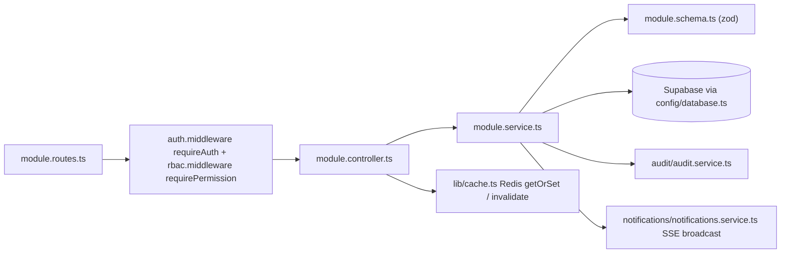

# Backend Modules (`backend/src/modules`)

## The shared per-module pattern

Every business module follows the same four-file layout:

| File | Responsibility |
|---|---|
| `<module>.routes.ts` | Express `Router`. Applies `requireAuth` then per-route `requirePermission(module, accessLevel, opts?)` (or legacy `requireRole([...])`). Mounts controller methods. |
| `<module>.controller.ts` | Thin HTTP layer: extracts tenant, builds `actorContext { role, name }` from `req.rbacScope`/`req.user`, calls service, invalidates Redis cache patterns, maps errors to status codes, returns `{ message, data }` or `{ error, message }`. |
| `<module>.service.ts` | Business logic. Talks to Supabase via `getDbClient()` (`backend/src/config/database.ts`), validates input with Zod schemas, enforces gates, writes audit logs, broadcasts SSE events via `notificationsService.broadcastEvent`. |
| `<module>.schema.ts` | Zod schemas for request payloads (e.g. `CustomerOrderSchema`, `OrderAmendmentSchema`). |

**Confirmed deviations from the 4-file pattern:**

- `auth` — no `auth.schema.ts`; instead has an extra `risk.service.ts` (login risk scoring).
- `orders` — extra `orders.state-machine.ts` (`OrderStateMachineService`) wrapping the shared
  `src/utils/orderStateMachine.ts` engine; resolves gate context (drawing revision, customer
  aging, open NCRs) from the DB before evaluating transitions.
- `inventory` — extra `inventory_movements.schema.ts` / `inventory_movements.service.ts`
  (append-only ledger with reversal).
- `testing` — only `testing.routes.ts` + `testing.service.ts` (dev-only workflow simulator,
  mounted only when `NODE_ENV !== 'production'`).
- `vendors` — service-only: `vendor-scorecard.service.ts`, no routes/controller of its own
  (scorecards are served through `purchasing` and `masters`).
- Route guard style is **mixed**: newer routes use `requirePermission(module, level)` from
  `rbacMatrix`; older ones use `requireRole(['SUPER ADMIN', 'OPERATOR', …])` with legacy role
  strings (bom, grn, qc, dispatch, finished-goods, invoices, masters users section).
- Transactional modules intentionally return `405 ERR_TRANSACTION_DELETE_FORBIDDEN` on
  `DELETE` (orders, production, purchasing, qc routes).

## Module map

| Module | Purpose (one line) | Key endpoints (mounted under `/api/v1/<mount>`) |
|---|---|---|
| `auth` | Custom JWT auth: login/refresh/logout, argon2 passwords, session registry, security events, user CRUD | `POST /login`, `POST /refresh`, `POST /logout`, `POST /register`, `GET /me`, `POST /change-password`, `GET /sessions`, `DELETE /sessions/:id`, `POST /sessions/revoke-others`, `POST /sessions/revoke-all`, `GET /security-events[/admin]`, `GET/PATCH/PUT/DELETE /users/:id` |
| `masters` | Master data: items, customers, vendors (masked bank), machines, users, dropdowns, company profile | `GET/POST /`, `PUT/DELETE /:code`, CRUD under `/customers`, `/vendors`, `/machines`, `/users`, `GET /vendors/:code/scorecard`, `GET /dropdowns`, `GET/PUT /company-profile` |
| `orders` | Customer-order CRUD + gated stage transitions + amendments + material verification | `GET /`, `GET /:id`, `POST /`, `PATCH/PUT /:id`, `POST /:id/transition` (also `PATCH /:id/status` and verb aliases `/submit`, `/confirm`, `/approve`, `/release`, `/cancel`), `POST /:id/material-check` (= `/verify-materials`), `POST /:id/override-material-check`, `POST /:id/amendments`, `POST /:id/mark-delayed`, `DELETE /:id` → 405 |
| `inventory` | Stock on hand, shortages, append-only movements ledger, reconciliation | `GET /stock`, `PUT/PATCH /stock/:code`, `GET /shortages`, `GET/POST /movements`, `POST /movements/:id/reverse`, `GET /movements/:code/history`, `GET /reconciliation` |
| `grn` | Goods receipt notes against purchase orders | `GET /`, `GET /:id`, `POST /`, `PATCH /:id/status` |
| `bom` | Bill of materials with revisions & approval status | `GET /`, `GET /:code`, `POST /`, `POST /duplicate`, `POST /:code/revision`, `PATCH /:code/status`, `DELETE /:code` |
| `purchasing` | Requisitions → POs → GRN → incoming QC → vendor returns → 3-way match → scorecards | `GET/POST /` (POs), `GET/POST /requisitions`, `PATCH /requisitions/:id/approve`, `GET/POST /grns`, `POST /grns/incoming-qc`, `GET /vendor-returns`, `PATCH /vendor-returns/:id/approve`, `GET /vendor-scorecards`, `POST /three-way-match` |
| `production` | Route cards, job cards, operation start/complete, production logs, NCR lifecycle, telemetry | `GET/POST /route-cards` (+ `/grouped`, `/duplicate`), `GET/POST /job-cards`, `POST /job-cards/:jobNo/start-op|complete-op|dispose-ncr`, `GET/POST /logs`, `POST /ncrs`, `GET /telemetry`, `DELETE /*` → 405 |
| `qc` | In-process QC queue, PDI queue, dispatch eligibility check | `GET/POST /inspections`, `PATCH /inspections/:id/review`, `GET /pdi`, `PATCH /pdi/:id/pass`, `GET /dispatch-eligibility/:orderPo` |
| `dispatch` | Delivery challans, dispatch/deliver/cancel, duplicate cleanup | `GET /`, `GET /orders/:order_id/dispatchable`, `GET /:challanNo[/print]`, `POST /`, `PUT /:challanNo`, `POST /:id/dispatch|deliver|cancel`, `PATCH /:challanNo/status`, `POST /cleanup-duplicates` |
| `finished-goods` | Finished-goods stock per order PO + reconciliation | `GET /`, `GET /:orderPo`, `POST /`, `PATCH /:id/reconcile` |
| `outwork` | Subcontractor gate-out / gate-in with overdue alerts | `GET /`, `POST /gate-out`, `POST /gate-in`, `GET /alerts/overdue` |
| `invoices` | Customer GST invoices: create, issue, pay, retry e-invoice processing | `GET /`, `GET /:invoiceNo`, `POST /`, `POST/PATCH /:invoiceNo/issue`, `POST /:invoiceNo/pay`, `POST /:invoiceNo/retry-processing` |
| `vendor-bills` | Vendor bills / payables | `GET /`, `GET /:billNo`, `POST /` (+ payment endpoint) |
| `audit` | Append-only audit log; reads restricted to admin roles; write/update/delete verbs blocked | `GET /`, `POST /`, `POST /export` |
| `approvals` | Pending-approval inbox (escalated high-value transactions, price amendments) | `GET /`, `POST /`, `POST /:id/approve`, `POST /:id/reject` |
| `notifications` | SSE stream + in-app notification CRUD + rules/recipients/logs | `GET /stream` (SSE), `GET /`, `PATCH /:id/read`, `POST /read-all`, `POST /trigger`, `GET/PATCH /rules`, `GET/POST/DELETE /recipients`, `GET /logs` |
| `attachments` | File upload/download via Supabase Storage + soft delete | `POST /`, `GET /`, `GET /:id`, `GET /:id/download`, `DELETE /:id` |
| `testing` | Dev-only golden-path workflow simulator | `GET /last-run`, `POST /run-golden-path` (admin roles only; mounted only when `NODE_ENV !== 'production'`) |

