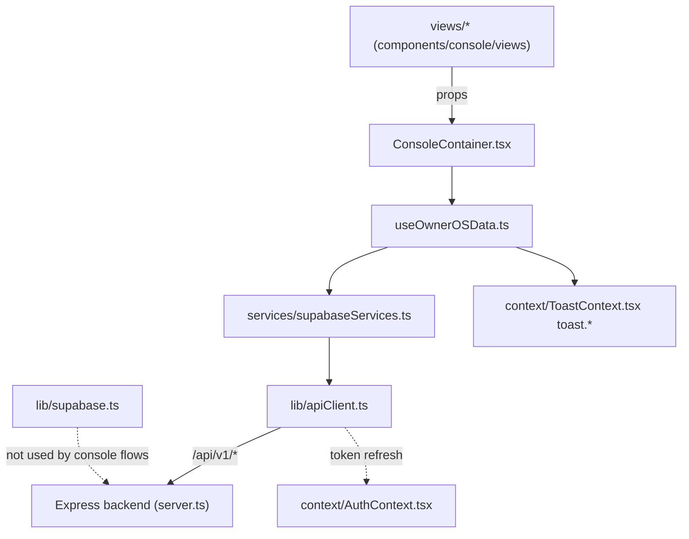

# Frontend Architecture

## Component layers

| Folder | Role |
|---|---|
| `src/components/console/views/*` | One full-screen feature per `ConsoleView` id (`src/types/console.ts`): `OrdersView`, `OrderDetailView`, `InventoryView`, `ProductionView`, `QCView`, `PDIView`, `DispatchView`, `InvoicesView`, `PayablesView`, `ApprovalsView`, `MastersView`, `UsersAuditView`, `CompanyProfileView`, `CommandCentreView`, `ReportsView`, `FinishedGoodsView`, `PlatingOutworkView`, `WorkflowTestingView`. Views are presentational + form logic: they receive all data and `handle*` callbacks as props from `ConsoleContainer` and never call the API directly. |
| `src/components/console/modals/*` | Cross-view dialogs owned by the shell: `CommandPaletteModal` (global Ctrl+K search/navigation), `SecuritySessionsModal` (active sessions & security events), `ChallanDetailModal` (print/edit dispatch challans), `JobCardDetailModal` (route-card step inspection). |
| `src/components/console/*` (shell) | `ConsoleContainer.tsx` maps URL routes (`/orders`, `/orders/:id`, `/qc`, …) to views via `getPathForView`, holds view-level UI state (selected order, modal flags) and RBAC gating with `AccessRestrictedGate`. `ConsoleHeader`, `ConsoleSidebar`, `MobileDrawer`, `MobileBottomTabBar` provide navigation; `AccentColorSelector` theme UI; `AgentBentoGrid` command-centre widgets. |
| `src/components/common/*` | Reusable building blocks used across marketing pages and console: `Modal`, `Dialog`, `StatusBadge`, `Breadcrumbs`, `CTAButton`, `Navbar`, `Footer`, `SEO`, `GuruOmLogo`, plus special-purpose `SwitchUserModal`, `ResendNotifModal`, `AccessRestrictedGate` (RBAC "no access" panel). |
| `src/components/base-ui/*` | Lowest-level generic primitives — currently only `table.tsx` (data-table styling). |
| `src/components/interactive/*`, `src/pages/*` | Public marketing-site widgets and pages (not part of the console app). |

## Context providers (mounted in `src/App.tsx`: Auth → AccentTheme → Toast)

| Provider | Owns |
|---|---|
| `AuthContext` (`src/context/AuthContext.tsx`) | Session lifecycle: `signIn`/`signUp`/`signOut` (REST via `apiClient`), session restore from `localStorage` on boot, idle-timeout tracking (default 15 min idle / 30 min hard ceiling), floating inactivity-warning modal, `refreshProfile()` (`GET /auth/me`), session security settings persisted under `guruom_session_security_settings`. Note: `signIn` has a legacy fallback that restores a cached "demo user" from `stratum_demo_users` when the API fails. |
| `ToastContext` (`src/context/ToastContext.tsx`) | Global toast queue (max 5 concurrent, auto-dismiss, countdown bar). Exposes `useToast()` and an imperative `toast.success/error/warning/info` singleton usable outside React (falls back to a `app:toast` window CustomEvent); also exposed as `window.appToast` for runtime testing. |
| `AccentThemeContext` (`src/context/AccentThemeContext.tsx`) | Accent color (blue/teal/orange/red) persisted at `sketchitup-accent-color`; writes `--accent-*` CSS variables on `document.documentElement` and syncs across tabs via the `storage` event. |

## Custom hooks (`src/hooks/`)

| Hook | Purpose |
|---|---|
| `useAuth.ts` | Single line re-export of `useAuth` from `AuthContext` (convenience import path). |
| `useOwnerOSData.ts` | The application's data backbone (~1.6k lines). Holds state for orders, stock, shortages, job cards, finished goods, outwork, production logs, QC/PDI queues, dispatches, invoices, payables, masters, customers, vendors, machines, users, audit logs, security events, approvals. `loadAllData()` fetches everything in parallel (view-gated by `isAllowed()`), plus a 3-minute reconciliation interval, SSE subscription (`order_created`, `order_updated`, `order_transitioned`, `job_card_created`, `job_card_updated`, `user_*`), and ~60 optimistic `handle*` action methods passed down to views. |
| `useUrlModal.ts` | Drives one modal's open/close from a `?modal=` (or custom param key) query param; extra params (e.g. `orderId`) round-trip through the URL so modals are deep-linkable; supports a second `modal2` param; `replace: true` avoids history pollution. Used e.g. by `OrdersView` as `useUrlModal('create-order')`. |
| `useInAppNotifications.ts` | Loads `/notifications` over REST, opens an SSE `EventSource` on `/notifications/stream` (token in query string), tracks unread count, plays alert sounds, `markAsRead`/`markAllAsRead`. |
| `usePullToRefresh.ts` | Touch pull-to-refresh gesture for mobile scroll containers (dampened pull distance + refresh callback). |
| `useSmoothScroll.ts` | Lenis inertial scrolling on desktop; disabled on touch/mobile; respects `[data-lenis-prevent]` and dialog containers; exposes `scrollTo()`. Used globally in `App.tsx`. |

## `lib/` vs `services/`

| File | Role |
|---|---|
| `src/lib/apiClient.ts` | The single HTTP transport. `API_BASE_URL = import.meta.env.VITE_API_BASE_URL || '/api/v1'`. Adds `Authorization: Bearer` from an in-memory token (restored from `stratum_access_token` if the session hasn't expired), sends `credentials: 'include'` for the httpOnly refresh cookie, maps status codes to friendly `ApiError` messages, and implements a silent refresh interceptor: on the first 401 it calls `POST /auth/refresh`, queues concurrent requests until the new token arrives, retries once, and fires `onAuthFailure` listeners (consumed by AuthContext) if refresh fails. Exposes `apiClient.get/post/put/patch/delete`. |
| `src/lib/supabase.ts` | A Supabase JS client built from `VITE_SUPABASE_URL`/`VITE_SUPABASE_ANON_KEY` (anon key, persistent session). It exists as an escape hatch, but console data flows through `apiClient`, not this client. |
| `src/lib/utils.ts`, `analytics.ts`, `notificationSound.ts` | `cn()` class merge, analytics helpers, WebAudio alert sounds. |
| `src/services/supabaseServices.ts` | The API service layer: one typed function per backend operation (`fetchOrders`, `insertOrder`, `confirmOrder`, `updateOrderStatus`, `runMaterialCheckForOrder`, `fetchMasters`, `insertDispatchChallan`, …). Each wraps `apiClient`, keeps an in-memory `ordersCache` for optimistic updates, and falls back to `localStorage` snapshots when the backend is unreachable (e.g. company profile, custom masters). Despite the filename, it is REST-based, not direct Supabase. |
| `src/services/notificationService.ts` | Types + helpers for the notification rules/recipients API. |
| `src/services/resendEmailService.ts` | Empty stub — "Email notification service removed as requested." |

