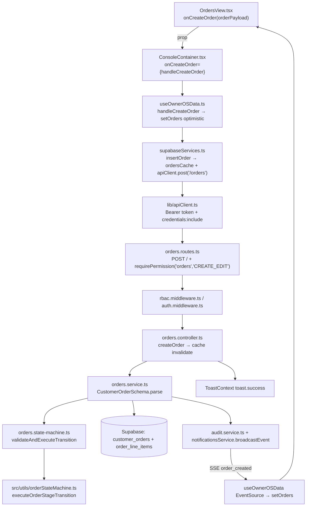

# File Linkage & Data Flow — one real end-to-end trace

Example: **creating a customer order** (the Orders flow touches every layer: view → container
hook → service → apiClient → Express route → controller → service → Supabase → SSE → UI).

## Step-by-step by function/file name

1. **User submits the "Create Order" form.**
   `src/components/console/views/OrdersView.tsx` — the modal form (opened via
   `const createOrderModal = useUrlModal('create-order')`) validates credit-hold override,
   PO number, and line items, builds `orderPayload: Partial<CustomerOrder>` (id `ord_<ts>_…`,
   `status: 'PO_RECEIVED'`, `lines[]`), then calls **`onCreateOrder(orderPayload)`** — a prop.

2. **Container wires the prop to the data hook.**
   `src/components/console/ConsoleContainer.tsx` renders
   `<OrdersView … onCreateOrder={handleCreateOrder} … />` (line ~574). `handleCreateOrder`
   comes from **`src/hooks/useOwnerOSData.ts`** (`const { handleCreateOrder } = useOwnerOSData(currentUser)`).

3. **Optimistic state + service call.**
   `useOwnerOSData.handleCreateOrder` (line ~565):
   `setOrders(prev => [order, ...prev])` → `await insertOrder(order)` → `addAuditLog('order','create',…)`
   → `toast.success(...)`. On failure it removes the optimistic entry and toasts the error.

4. **API service layer.**
   `src/services/supabaseServices.ts::insertOrder` — upserts the order into the module-level
   `ordersCache`, then `await apiClient.post('/orders', order)` (errors propagate for rollback).

5. **Transport.**
   `src/lib/apiClient.ts::apiClient.post` → `executeRequest('POST','/orders',body)` →
   `fetch(API_BASE_URL + '/orders')` with `Authorization: Bearer <token>` and
   `credentials: 'include'` (401 triggers the silent `POST /auth/refresh` retry).

6. **Route + middleware.**
   `backend/src/modules/orders/orders.routes.ts`:
   `router.post('/', requirePermission('orders', 'CREATE_EDIT', { commercialCheck: true }), …)`.
   `requireAuth` (Bearer JWT) already applied via `router.use(requireAuth)`.
   `backend/src/middleware/rbac.middleware.ts::requirePermission` normalizes the role, checks
   access level, writes `RBAC_PERMITTED_POST` audit log, then calls next().

7. **Controller.**
   `backend/src/modules/orders/orders.controller.ts::createOrder` — builds
   `actorContext { role, name }` from `req.rbacScope ?? req.user`, calls
   `ordersService.createOrder(req.body, actorContext)`, then invalidates
   `cache:<tenant>:orders:*` and `cache:<tenant>:dashboard:*` in Redis
   (`backend/src/lib/cache.ts`), and returns `201 { message: 'Order created and passed Stage 1
   verification successfully', data: created }`.

8. **Service + gates.**
   `backend/src/modules/orders/orders.service.ts::createOrder` (line ~526):
   `CustomerOrderSchema.parse(data)` (Zod, from `orders.schema.ts`) → builds a
   `StateMachineContext` → `orderStateMachineService.validateAndExecuteTransition(ctx)`
   (`orders.state-machine.ts`) which loads item-master drawing revision, 90-day customer
   receivables, and open NCRs from the DB, then runs the pure engine
   `executeOrderStageTransition` from **`src/utils/orderStateMachine.ts`** (shared with the
   frontend). On failure → `400 { error: ERR_…, message }`. On success → inserts
   `customer_orders` row and `order_line_items` rows via the Supabase service client
   (`backend/src/config/database.ts::getDbClient`), records audit logs.

9. **Realtime fan-out.**
   The service/`notificationsService.broadcastEvent('order_created', order)` pushes an SSE
   event; `useOwnerOSData`'s `EventSource` listener (`/api/v1/notifications/stream`) receives
   `order_created` and merges the record into `setOrders` on **every** connected client.

10. **UI settles.**
    `fetchOrders()` re-syncs on next `loadAllData()` (initial load, 3-minute reconciliation,
    or after other actions). `supabaseServices.fetchOrders` merges the backend payload over
    `ordersCache` and sorts newest-first; `ConsoleContainer` re-renders `<OrdersView orders={…}>`.

**Response shape (create):** `{ message: string, data: CustomerOrder }` where the list GET
returns `{ data: CustomerOrder[] }` with camelCase fields (`poNo`, `stage`, `progressStep`,
`lines[]`, `jobCards[]`, `dispatches[]`, `paymentStatus`, …) mapped from snake_case columns in
`ordersService.getOrders()`.

**Confirm variant (stage transition):** `OrderDetailView.tsx` "Confirm Order" CTA →
`onConfirmOrder(order.id)` prop → `ConsoleContainer` inline handler (line ~599) →
`useOwnerOSData.handleConfirmOrder` (optimistic `CONFIRMED`, `progressStep: 2`) →
`supabaseServices.confirmOrder` → `POST /orders/:id/confirm` → `orders.routes.ts` sets
`req.body.targetStage = 'CONFIRMED'` → `OrdersController.transitionOrder` →
`OrdersService.transitionOrderStage` → state-machine gate → response `{ message, data }` →
`setOrders` merge + SSE `order_transitioned`.

