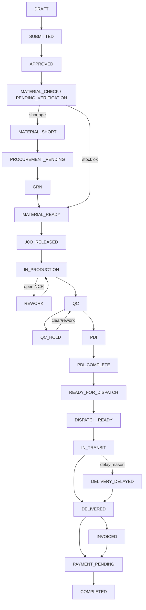

# Business Workflow — the Order State Machine

The canonical engine is **`src/utils/orderStateMachine.ts`** (pure functions, no imports — it is
consumed by BOTH the frontend, e.g. `OrderDetailView.tsx`, and the backend via
`backend/src/modules/orders/orders.state-machine.ts`). Migration
`supabase/migrations/014_order_state_machine_and_gates.sql` adds the matching DB columns
(`sub_type`, `drawing_revision`, `heat_lot_number`, `is_credit_held`, …) and the
`purchase_requisitions` table.

## Stages (canonical) and adjacency

`ALLOWED_TRANSITIONS` defines the only legal moves; anything else is rejected. Legacy/display
aliases are mapped by `normalizeOrderState()` (e.g. `PO_RECEIVED → SUBMITTED`,
`CONFIRMED → APPROVED`, `READY_TO_DISPATCH → READY_FOR_DISPATCH`, `CLOSED/PAID → COMPLETED`).

Main forward path (abbreviated):

`DRAFT → SUBMITTED → APPROVED → (material check) MATERIAL_READY → JOB_RELEASED → IN_PRODUCTION → QC → PDI/PDI_COMPLETE → READY_FOR_DISPATCH → DISPATCH_READY → IN_TRANSIT → DELIVERED → PAYMENT_PENDING → COMPLETED`

Side branches: `MATERIAL_SHORT → PROCUREMENT_PENDING → GRN → MATERIAL_READY` (shortage loop),
`REWORK → IN_PRODUCTION` (NCR loop-back), `QC_HOLD/PDI_HOLD → QC/PDI` (clearance),
`DELIVERY_DELAYED → DELIVERED` (only "Order Received" unlocks payment), `… → DRAFT` (recovery
from SUBMITTED/APPROVED).

## What gates each transition (and where it is enforced)

| Gate | Rule | Enforced by |
|---|---|---|
| RBAC action authorization | Role must hold `CREATE_EDIT` on `orders` (view needs `VIEW_ONLY`) | `backend/src/middleware/rbac.middleware.ts::requirePermission` wired in `orders.routes.ts`; UI disables CTAs via `rbacMatrix.isRoleAuthorizedForCta` |
| Drawing revision (order entry & release) | Order revision must equal item-master approved revision | `orderStateMachine.ts::validateDrawingRevision`; context loaded in `orders.state-machine.ts` (queries `items` table) |
| Customer credit control | Any invoice > 90 days overdue ⇒ Credit Hold; only Owner/Admin override with reason | `orderStateMachine.ts::validateCustomerCredit`; overdue query in `orders.state-machine.ts` (`customer_invoices`); UI pre-check in `OrdersView.tsx` (override username required) |
| Material availability | Shortage is allowed but auto-generates a Purchase Requisition | `orderStateMachine.ts::validateMaterialAvailability`; auto-action persisted in `orders.state-machine.ts` (inserts `purchase_requisitions`) and audit-logged |
| Heat/Lot traceability | Mandatory heat/lot number at job-card release / material issue | `orderStateMachine.ts::validateHeatLotNumber` (checked in `executeOrderStageTransition` step 5); also `productionEngine` rules |
| Procurement dependency | Cannot release job cards while `PROCUREMENT_PENDING` | `executeOrderStageTransition` step 5 (`ERR_MATERIAL_NOT_READY`) |
| Open NCR block | No open NCRs (`OPEN`, `UNDER_REVIEW`, `REWORK_PLANNED`) at QC/PDI/READY_FOR_DISPATCH | `orderStateMachine.ts::validateNoOpenNcrs`; NCR query in `orders.state-machine.ts` (`ncrs` table) |
| QC report before PDI | PDI requires uploaded/passed QC report | `executeOrderStageTransition` step 6a (`hasQcReport`) |
| Invoice vs dispatched qty | Quantities must match, else explicit override reason (audit-logged) | `orderStateMachine.ts::validateInvoiceQuantity` |
| Challan before transit | `IN_TRANSIT` requires a generated delivery challan | `executeOrderStageTransition` step 8 (`hasChallan`) |
| POD before delivered | `DELIVERED` requires a POD document URL | `orderStateMachine.ts::validatePodRequired` |
| Payment before closure | `COMPLETED` requires delivered status + full payment (`ERR_PAYMENT_INCOMPLETE`) | `orderStateMachine.ts::validateOrderClosure` |
| Change-order control | Amendments blocked when job cards exist unless Owner override; price change always needs Owner approval | `orderStateMachine.ts::validateChangeOrder` + `validateAmendmentApproval`; approval tickets inserted into `pending_approvals` by `orders.service.ts::createAmendment` |
| Monetary approval limits | Transactions above a role's `approvalLimit` escalate to Owner (`202 ESCALATED_TO_OWNER`) | `rbacMatrix.isWithinApprovalLimit` used by `rbac.middleware.ts` and `purchasing` module |

Every blocked transition and every auto-action is written to the append-only audit log via
`backend/src/modules/audit/audit.service.ts` (`ORDER_STAGE_GATE_BLOCKED`,
`OVERRIDE_MATERIAL_CHECK`, …).

## Stage sequence

